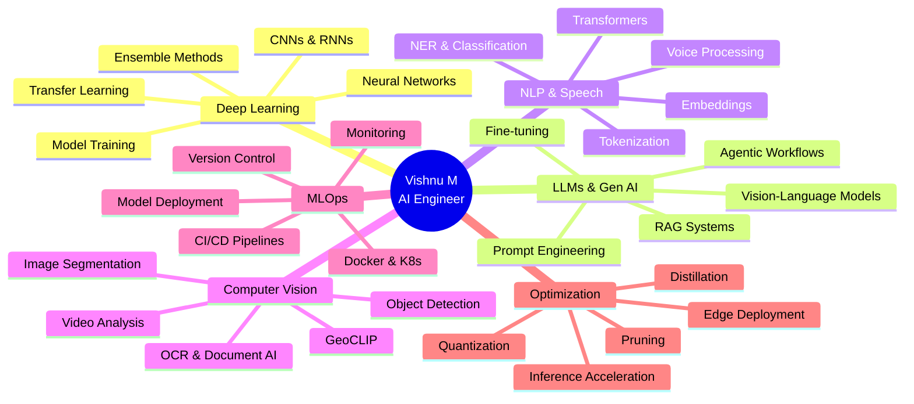

# <div align="center"></div>

<div align="center">
  
</div>

<div align="center">
  
  [](https://github.com/vishnu80152)
  [](https://github.com/vishnu80152?tab=followers)
  [](https://github.com/vishnu80152?tab=repositories)
  [](https://www.google.com/maps/place/Coimbatore)
  [](https://vishnu-ai-nexus-sphere.lovable.app)
  
</div>


## <div align="center">🌟 **ELITE AI ENGINEER & INNOVATOR** 🌟</div>

<table align="center">
<tr>
<td width="50%">

###  WHO AM I?

```python
class VishnuM:
    def __init__(self):
        self.role = "AI Engineer"
        self.company = "CTD Techs"
        self.experience = "3 Years of Excellence"
        self.education = "B.Tech AI & Data Science"
        self.cgpa = "8.3/10 (First Class)"
        self.location = "Coimbatore, Tamil Nadu"
        self.mission = "Building Production-Ready AI Solutions"
    
    def impact_metrics(self):
        return {
            "chatbot_accuracy": "95% retrieval precision",
            "situational_awareness": "90% improvement",
            "model_optimization": "50% size reduction",
            "pipeline_automation": "80% faster workflows",
            "manual_work_saved": "70% reduction",
            "inference_speed": "40% performance boost",
            "ieee_publications": "3 research papers",
            "deployment_acceleration": "50% faster"
        }
    
    def core_expertise(self):
        return [
            "🎯 Vision-Language Models (VLMs)",
            "🤖 Autonomous AI Agents & RAG",
            "💬 Conversational AI (95% accuracy)",
            "🗣️ Multimodal NLP & Voice Systems",
            "⚡ Model Quantization & Edge AI",
            "🎨 Computer Vision Pipelines",
            "🌐 Production ML Deployment",
            "🔧 MLOps & CI/CD Automation"
        ]
```

</td>
<td width="50%">


### 🚀 **QUANTIFIED ACHIEVEMENTS**

<div align="center">


</div>

### 💡 **WHAT I BUILD**

> Specializing in **Deep Learning**, **Large Language Models**, **RAG Systems**, and **Model Optimization**. Expert in deploying **enterprise-grade AI solutions** with **TensorFlow**, **PyTorch**, **LangChain**, **vLLM**, and **Docker**. 
> 
> Strong backend engineering with **Flask** & **FastAPI**, building **scalable production systems** that deliver real business value.

**Current Mission:** Pushing the boundaries of multimodal AI, agentic systems, and edge deployment.

</td>
</tr>
</table>


##  **CONNECT WITH ME**

<div align="center">
  <a href="mailto:vishnu80152@gmail.com">
    
  </a>
  <a href="https://github.com/vishnu80152">
    
  </a>
  <a href="https://www.linkedin.com/in/vishnu-m-015459324/">
    
  </a>
  <a href="https://vishnu-ai-nexus-sphere.lovable.app">
    
  </a>
  <a href="tel:+918015255825">
    
  </a>
</div>


##  **PROFESSIONAL JOURNEY**

### 🚀 **Lead Machine Learning Engineer & Client Manager**
### 🏢 **Pinaca Technologies** | 📅 June 2023 - Present | 📍 Chennai, India

<table>
<tr>
<td width="33%">

#### 🧠 **Vision & Language AI**
```yaml
Vision-LLM Platform:
  Impact: 90% situational awareness ↑
  Features:
    - Real-time person tracking
    - Blueprint integration
    - Visual reasoning engine
  
Autonomous News Agent:
  Impact: 80-90% efficiency gain
  Capabilities:
    - Personalized updates
    - Auto slide generation
    - Dashboard analytics
```

</td>
<td width="33%">

#### 💬 **Conversational Systems**
```yaml
NL-to-SQL Chatbot:
  Purpose: Mission data access
  Tech:
    - Natural language interface
    - SQL query translation
    - Real-time execution
  
Production RAG System:
  Impact: 95% accuracy, 70% time saved
  Features:
    - Multi-format parsing
    - Contextual retrieval
    - Enterprise deployment
```

</td>
<td width="33%">

#### 🎯 **Model Engineering**
```yaml
8-bit Quantization:
  Impact: 50% size ↓, 40% speed ↑
  Use Case:
    - Edge deployment
    - Resource optimization
    - Mobile inference
  
Automated CI/CD:
  Impact: 80% validation speed ↑
  Stack:
    - Docker containers
    - MLflow tracking
    - 50% faster deployment
```

</td>
</tr>
</table>

<details>
<summary><b>🔥 Click to See All Achievements</b></summary>

<br>

- 🗣️ **Voice Assistant System**: Speech-to-text, multilingual translation, TTS, facial authentication pipeline
- 🎤 **Audio Processing**: CNN/RNN for diarization, denoising, speaker ID (+25% accuracy in noisy environments)
- 🌍 **GeoCLIP Integration**: Image-to-location with LangChain agents (30% latency reduction)
- 📝 **OCR Pipeline**: Handwritten log processing with 90% precision (60% manual work eliminated)
- 🎨 **Vision-LLM**: Visual understanding & OCR extraction using vLLM framework
- 🔊 **Speaker Diarization**: Multi-speaker transcription with accurate segmentation
- 🌐 **Translation Models**: Multilingual support for product workflows & communication
- 🏗️ **MLOps Infrastructure**: Docker-based deployment with automated model validation

</details>


##  **FLAGSHIP PROJECTS**

<div align="center">
  
</div>

<table>
<tr>
<td width="50%">

### 🤖 **Fully Agentic Multi-Format RAG**


**Enterprise RAG Platform**
- ✅ Unified retrieval: PDF, DOCX, PPT, JSON, Images, Audio
- ✅ Intelligent document parsing & chunking
- ✅ 95% contextual accuracy at scale
- ✅ Agentic workflow orchestration
- ✅ Docker-based production deployment

**Stack:** LangChain, LangGraph, Qdrant, FastAPI

[](https://github.com/vishnu80152)

</td>
<td width="50%">

### 👁️ **Vision-Language Model System**


**Multimodal AI Engine**
- ✅ Visual understanding with vLLM backend
- ✅ OCR-based text extraction & reasoning
- ✅ Image-driven query processing
- ✅ Real-time blueprint tracking
- ✅ Scalable inference pipeline

**Stack:** vLLM, PyTorch, OpenCV, Flask

[](https://github.com/vishnu80152)

</td>
</tr>
<tr>
<td width="50%">

### 🗺️ **Real-Time Tracking Intelligence**


**Spatial Intelligence Platform**
- ✅ Person tracking on floor blueprints
- ✅ LLM-powered natural language queries
- ✅ 90% situational awareness improvement
- ✅ WebSocket real-time updates
- ✅ RESTful API architecture

**Stack:** Computer Vision, LLMs, WebSockets

[](https://github.com/vishnu80152)

</td>
<td width="50%">

### 🌐 **Universal Document Parser**


**Intelligent Data Extraction**
- ✅ ANY format → Structured JSON/Text
- ✅ PDF, DOCX, PPT, Images, Audio, Logs
- ✅ Batch processing with parallel execution
- ✅ Clean, normalized outputs
- ✅ API-first design

**Stack:** Python, Transformers, OCR, NLP

[](https://github.com/vishnu80152)

</td>
</tr>
<tr>
<td width="50%">

### 🗣️ **Advanced Speaker Diarization**


**Speech Intelligence System**
- ✅ Multi-speaker identification & separation
- ✅ ASR with speaker-segmented transcripts
- ✅ 25% accuracy boost in noisy environments
- ✅ Real-time & batch processing modes
- ✅ Production-ready pipeline

**Stack:** PyTorch, Audio Processing, Deep Learning

[](https://github.com/vishnu80152)

</td>
<td width="50%">

### 🌍 **Multilingual Translation Engine**


**Global Communication Bridge**
- ✅ Product workflow translation support
- ✅ Document & communication pipelines
- ✅ Real-time translation API
- ✅ Multiple language pairs
- ✅ Context-aware translations

**Stack:** Transformers, Hugging Face, FastAPI

[](https://github.com/vishnu80152)

</td>
</tr>
</table>

### 🏆 **Impact Dashboard**

<div align="center">

| 🎯 Metric | 📊 Achievement | ⚙️ Technology Stack |
|-----------|----------------|---------------------|
| **RAG Accuracy** | 95% retrieval precision | LangChain + Qdrant + Embeddings |
| **Inference Speed** | 40% faster processing | 8-bit quantization + vLLM |
| **Automation** | 80-90% efficiency gain | Agentic workflows + LangGraph |
| **Manual Work** | 70% reduction | OCR + Intelligent parsing |
| **Audio Accuracy** | 25% boost (noisy env) | CNN/RNN pipelines |
| **Geolocation** | 30% latency reduction | GeoCLIP + LangChain agents |
| **Deployment** | 50% faster time-to-prod | Docker + MLflow + CI/CD |

</div>


##  **TECHNOLOGY ARSENAL**

<div align="center">

### 💻 **Core Languages**


### 🧠 **ML & Deep Learning**


### 🤗 **LLMs & Generative AI**


### 📊 **Data Science & Analytics**


### ⚙️ **Backend & APIs**


### 🗄️ **Databases & Vector Stores**


### ☁️ **DevOps & MLOps**


### 🎯 **Specialized Capabilities**


</div>


##  **EXPERTISE DOMAINS**

<div align="center">



</div>


##  **RESEARCH & PUBLICATIONS**

<div align="center">

### 📚 **IEEE Published Research Papers**

<table>
<tr>
<td align="center" width="33%">

<br><br>
<h4>🔧 Predictive Maintenance</h4>
<p><b>Machine Tools using Machine Learning</b></p>
<p>Advanced predictive analytics for industrial equipment maintenance and failure prevention</p>
<br>

</td>
<td align="center" width="33%">

<br><br>
<h4>🚑 Emergency Medical System</h4>
<p><b>AI-Powered Autonomous Vehicles</b></p>
<p>Intelligent emergency detection and autonomous response system for critical situations</p>
<br>

</td>
<td align="center" width="33%">

<br><br>
<h4>👁️ Driver Drowsiness Detection</h4>
<p><b>Deep Learning Safety System</b></p>
<p>Real-time driver monitoring using computer vision and deep neural networks</p>
<br>

</td>
</tr>
</table>

### 🎓 **Research Impact**


</div>


##  **EDUCATION**

<div align="center">

### 🎓 **Bachelor of Technology in Artificial Intelligence & Data Science**
### 🏫 **Sri Eshwar College of Engineering, Coimbatore**


**Academic Highlights:**
- 🏆 Published 3 IEEE research papers during undergraduate studies
- 💡 Specialized in Machine Learning, Deep Learning, and AI systems
- 📊 Strong foundation in Data Science, Statistics, and Mathematics
- 🚀 Hands-on experience with real-world AI/ML projects
- 🎯 Focus on production-ready ML systems and deployment

**Key Coursework:**
`Deep Learning` · `Natural Language Processing` · `Computer Vision` · `Data Structures` · `Machine Learning` · `Statistical Methods` · `Neural Networks` · `AI Algorithms`

</div>


##  **CURRENT FOCUS & LEARNING**

<div align="center">
  
</div>

<br>

<table align="center">
<tr>
<td width="50%">

### 🎯 **Active Learning Paths**

```yaml
Advanced Topics:
  - Multi-Agent Systems
  - Vision-Language Models (VLMs)
  - Graph Neural Networks
  - Reinforcement Learning for LLMs
  - Model Compression Techniques
  - Distributed Training

Frameworks & Tools:
  - LangGraph for complex workflows
  - vLLM for high-performance inference
  - Ray for distributed computing
  - Kubernetes for ML deployment
  - Advanced prompt engineering
```

</td>
<td width="50%">

### 🚀 **Upcoming Projects**

```yaml
In Development:
  - Multi-modal RAG with audio/video
  - Autonomous coding assistant
  - Real-time streaming LLM APIs
  - Edge AI deployment toolkit
  - Advanced document intelligence
  
Research Interests:
  - Efficient fine-tuning methods
  - Hallucination reduction in RAG
  - Zero-shot learning approaches
  - Privacy-preserving ML
```

</td>
</tr>
</table>


##  **OPEN TO OPPORTUNITIES**

<div align="center">

### 🎯 **Seeking Roles In:**

<table>
<tr>
<td align="center" width="25%">

<h4>🤖 ML Engineer</h4>
<p>Building intelligent systems that scale</p>
</td>
<td align="center" width="25%">

<h4>🧠 AI Research</h4>
<p>Pushing boundaries of what's possible</p>
</td>
<td align="center" width="25%">

<h4>💬 NLP Engineer</h4>
<p>Language understanding & generation</p>
</td>
<td align="center" width="25%">

<h4>🚀 MLOps Lead</h4>
<p>Production ML at enterprise scale</p>
</td>
</tr>
</table>

### 💼 **What I Bring to the Table**


**Core Strengths:**
- ✅ End-to-end ML pipeline development & deployment
- ✅ Production-grade RAG systems with 95% accuracy
- ✅ Model optimization (50% size reduction, 40% speed increase)
- ✅ LLM integration & agentic workflow design
- ✅ Computer vision & multimodal AI
- ✅ Strong backend engineering (Flask, FastAPI)
- ✅ Team leadership & client management
- ✅ Research-backed approach with 3 IEEE publications

</div>


##  **LET'S BUILD SOMETHING AMAZING**

<div align="center">

### 🌟 **I'm passionate about:**
  
Transforming cutting-edge AI research into **production-ready solutions** that deliver **real business value**. Whether it's building **intelligent chatbots**, optimizing **LLM inference**, or deploying **computer vision systems**, I bring a unique blend of **research depth** and **engineering rigor**.

### 💡 **Always exploring:**
  
New ways to make AI more **efficient**, **accessible**, and **impactful**. From **agentic workflows** to **edge deployment**, I'm constantly pushing the boundaries of what's possible with modern AI.

<br>

### 📬 **Get In Touch**

<a href="mailto:vishnu80152@gmail.com">
  
</a>
<a href="https://www.linkedin.com/in/vishnu-m-015459324/">
  
</a>
<a href="https://vishnu-ai-nexus-sphere.lovable.app">
  
</a>

<br><br>


</div>

---

<div align="center">
  
</div>
