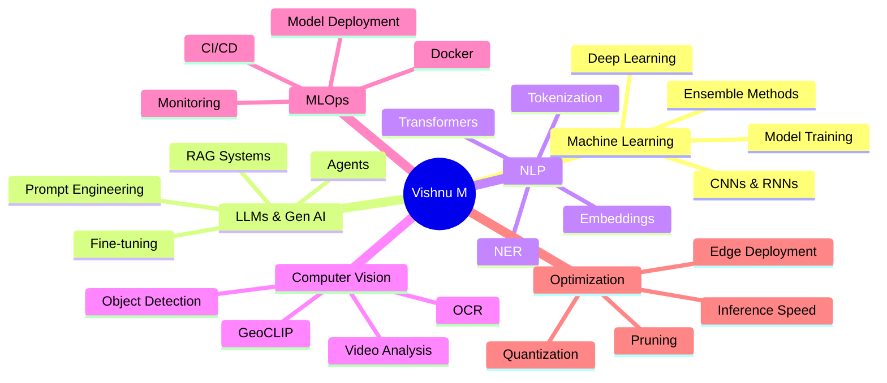

# <div align="center"></div>

<div align="center">
  
</div>

<div align="center">
  
  [](https://github.com/vishnu80152)
  [](https://github.com/vishnu80152?tab=followers)
  [](https://github.com/vishnu80152?tab=repositories)
  [](https://www.google.com/maps/place/Coimbatore)
  [](https://vishnu-ai-nexus-sphere.lovable.app)
  
</div>


## <div align="center">🌟 **ELITE AI ENGINEER & INNOVATOR** 🌟</div>

<table align="center">
<tr>
<td width="50%">

###  WHO AM I?

```python
class VishnuM:
    def __init__(self):
        self.role = "Lead ML Engineer & Client Manager"
        self.company = "Pinaca Technologies"
        self.experience = "1.5+ Years of Excellence"
        self.education = "B.Tech AI & Data Science"
        self.cgpa = "8.3/10 (First Class)"
        self.location = "Chennai, India"
        self.superpower = "Turning AI dreams into reality"
    
    def achievements(self):
        return {
            "situational_awareness": "90% boost",
            "chatbot_accuracy": "95% retrieval",
            "optimization": "50% model size reduction",
            "automation": "80% faster pipelines",
            "publications": "3 IEEE research papers",
            "manual_reduction": "70% less oversight",
            "inference_boost": "40% faster",
            "deployment_speed": "50% acceleration"
        }
    
    def specialties(self):
        return [
            "🎯 Vision-LLM Systems",
            "🤖 Autonomous AI Agents",
            "💬 RAG Chatbots (95% accuracy)",
            "🗣️ Multimodal NLP & Voice AI",
            "⚡ Model Quantization & Optimization",
            "🎨 Computer Vision Pipelines",
            "🌐 Production ML Deployment"
        ]
```

</td>
<td width="50%">


### 🚀 **IMPACT METRICS**

<div align="center">


</div>

### 💡 **WHAT I DO**

> Specializing in **Deep Learning**, **LLM Integration**, **Model Optimization**, and **RAG-based Systems**. Expert in deploying **scalable ML solutions** using cutting-edge tech like **TensorFlow**, **PyTorch**, **LangChain**, **vLLM**, and **Docker**. Strong in **backend development** with **Flask** & **FastAPI**, building **production-ready AI systems** that actually work.

</td>
</tr>
</table>


##  **CONNECT WITH ME**

<div align="center">
  <a href="mailto:vishnu80152@gmail.com">
    
  </a>
  <a href="https://github.com/vishnu80152">
    
  </a>
  <a href="https://www.linkedin.com/in/vishnu-m-015459324/">
    
  </a>
  <a href="https://vishnu-ai-nexus-sphere.lovable.app">
    
  </a>
  <a href="tel:+918015255825">
    
  </a>
</div>


##  **PROFESSIONAL JOURNEY**

### 🚀 **Lead Machine Learning Engineer & Client Manager**
### 🏢 **Pinaca Technologies** | 📅 June 2023 - Present | 📍 Chennai

<table>
<tr>
<td width="33%">

#### 🧠 **Vision & LLM Systems**
```yaml
Vision-LLM Platform:
  - Real-time person tracking
  - Blueprint integration
  - 90% awareness boost
  
Autonomous News Agent:
  - Personalized updates
  - Slides & dashboards
  - 80-90% efficiency gain
```

</td>
<td width="33%">

#### 💬 **Conversational AI**
```yaml
NL-to-SQL Chatbot:
  - Natural language queries
  - Mission data access
  - SQL translation engine
  
Production RAG System:
  - 95% retrieval accuracy
  - Multi-format parsing
  - 70% manual reduction
```

</td>
<td width="33%">

#### 🎯 **Model Optimization**
```yaml
8-bit Quantization:
  - 50% size reduction
  - 40% inference boost
  - Edge deployment ready
  
Automated CI/CD:
  - 80% faster validation
  - 50% quicker deployment
  - Docker + MLflow
```

</td>
</tr>
</table>

<details>
<summary><b>🔥 Click to See More Achievements</b></summary>

<br>

- 🗣️ Built **Voice Assistant** with speech-to-text, translation, TTS & **face-ID authentication**
- 🎤 Deployed **CNN/RNN pipelines** for audio: diarization, denoising, speaker ID (+25% accuracy in noise)
- 🌍 Implemented **GeoCLIP** image-to-location with LangChain agents (30% latency reduction)
- 📝 Created **OCR pipeline** for handwritten logs with 90% precision (60% manual work eliminated)
- 🎨 Built **Vision-based LLM** using vLLM for visual understanding & OCR extraction
- 🔊 Engineered **speaker diarization & transcription** system with accurate speaker segmentation

</details>


##  **EPIC PROJECTS SHOWCASE**

<div align="center">
  
</div>

<table>
<tr>
<td width="50%">

### 🤖 **Fully Agentic Multi-Format RAG**


**The Ultimate RAG System**
- ✅ Unified retrieval across ALL formats
- ✅ PDF, DOCX, PPT, JSON, Images, Audio
- ✅ Automated parsing & processing
- ✅ 95% contextual accuracy
- ✅ Production-ready architecture

**Tech:** LangChain, LangGraph, Docker, Qdrant

</td>
<td width="50%">

### 👁️ **Vision-Based LLM System**


**Multimodal AI Pipeline**
- ✅ Visual understanding with vLLM
- ✅ OCR-based text extraction
- ✅ Image-driven reasoning
- ✅ Real-time processing
- ✅ Blueprint tracking integration

**Tech:** vLLM, PyTorch, Computer Vision

</td>
</tr>
<tr>
<td width="50%">

### 🗺️ **Live Tracking & Monitoring**


**Real-Time Intelligence Platform**
- ✅ Person tracking on blueprints
- ✅ LLM query engine integration
- ✅ Natural language insights
- ✅ 90% situational awareness boost
- ✅ Scalable architecture

**Tech:** Computer Vision, LLMs, Flask

</td>
<td width="50%">

### 🌐 **Universal Data Parsing Engine**


**One Parser to Rule Them All**
- ✅ Convert ANY format to text/JSON
- ✅ PDF, DOCX, PPT, Images, Audio, Logs
- ✅ Clean, structured output
- ✅ Batch processing support
- ✅ API-ready deployment

**Tech:** Python, OCR, NLP, Transformers

</td>
</tr>
<tr>
<td width="50%">

### 🗣️ **Speaker Diarization System**


**Advanced Speech Intelligence**
- ✅ Multi-speaker identification
- ✅ ASR with diarization
- ✅ Speaker-segmented transcripts
- ✅ 25% accuracy in noisy environments
- ✅ Production-grade pipeline

**Tech:** Audio Processing, Deep Learning

</td>
<td width="50%">

### 🌍 **Multilingual Translation Models**


**Breaking Language Barriers**
- ✅ Product workflow support
- ✅ Communication pipelines
- ✅ Document processing
- ✅ Real-time translation
- ✅ Multiple language pairs

**Tech:** Transformers, NLP, Hugging Face

</td>
</tr>
</table>

### 🏆 **Project Impact Summary**

<div align="center">

| Metric | Achievement | Technology |
|--------|-------------|------------|
| 🎯 **RAG Accuracy** | 95% retrieval precision | LangChain + Qdrant |
| ⚡ **Inference Speed** | 40% faster processing | 8-bit quantization |
| 🤖 **Automation** | 80-90% efficiency gain | Autonomous agents |
| 📊 **Manual Work** | 70% reduction | OCR + Parsing |
| 🎤 **Audio Accuracy** | 25% boost in noise | CNN/RNN pipelines |
| 🌍 **Latency** | 30% faster geolocation | GeoCLIP + LangChain |

</div>


##  **TECH ARSENAL**

<div align="center">

### 💻 **Languages**


### 🧠 **ML & AI Frameworks**


### 🤗 **LLMs & NLP**


### 📊 **Data Science**


### ⚙️ **Backend & APIs**


### 🗄️ **Databases & Vector Stores**


### ☁️ **DevOps & Tools**


### 🎯 **Specialized Skills**


</div>


##  **DOMAIN EXPERTISE**

<div align="center">



</div>


##  **RESEARCH & PUBLICATIONS**

<div align="center">

### 📚 **IEEE Published Papers**

<table>
<tr>
<td align="center" width="33%">

<br><br>
<h4>🔧 Predictive Maintenance</h4>
<p><b>Machine Tools using ML</b></p>
<p>Advanced predictive analytics for industrial equipment</p>
</td>
<td align="center" width="33%">

<br><br>
<h4>🚑 Emergency Medical System</h4>
<p><b>Autonomous Vehicle AI</b></p>
<p>AI-assisted emergency detection & response</p>
</td>
<td align="center" width="33%">

<br><br>
<h4>👁️ Driver Drowsiness Detection</h4>
<p><b>Deep Learning Approach</b></p>
<p>Real-time safety monitoring system</p>
</td>
</tr>
</table>

</div>


##  **EDUCATION**

<div align="center">

### 🎓 **B.Tech in Artificial Intelligence & Data Science**
### 🏫 **Sri Eshwar College of Engineering**


**Highlights:**
- 🏆 Published 3 IEEE research papers
- 💡 Worked on cutting-edge AI projects
- 📊 Strong foundation in ML, DL, and Data Science
- 🚀 Hands-on experience with production systems

</div>


##  **GITHUB ANALYTICS**

<div align="center">
  
  
</div>

<div align="center">
  
</div>

<div align="center">
  
</div>

<div align="center">
  
</div>


##  **CURRENT FOCUS**

<div align="center">
  
</div>


##  **SEEKING OPPORTUNITIES**

<div align="center">

### 🎯 **Open to Roles In:**

<table>
<tr>
<td align="center" width="25%">

<h4>🤖 ML Engineer</h4>
<p>Building intelligent systems</p>
</td>
